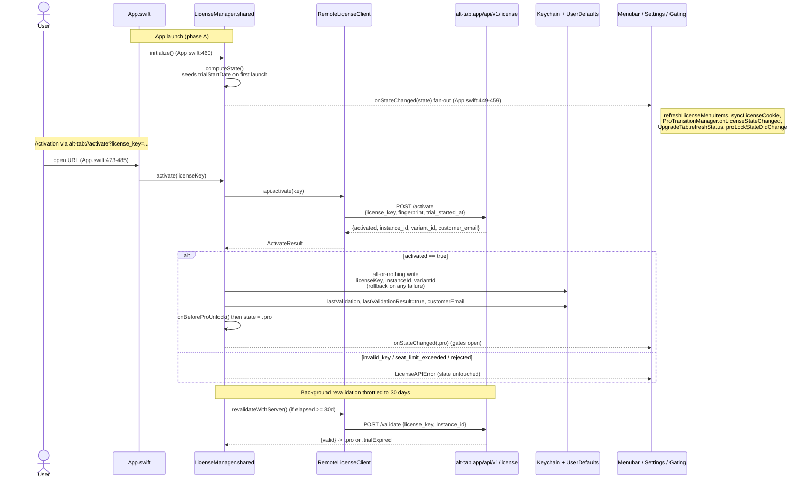
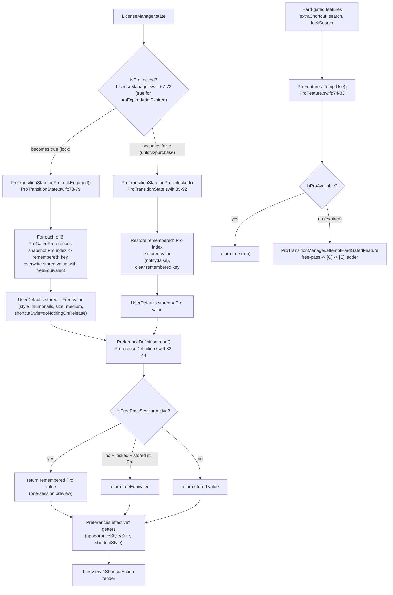

# alt-tab-free — System Graphs

Visual companion to the paywall-removal audit (`docs/audit/01..09`). Five Mermaid diagrams:
overall architecture, license activation/state flow, the Day1→Day35 trial-nag escalation, the
feature-gating downgrade/restore mechanism, and the removal map (delete vs edit vs keep).

All `file:line` references are against branch `master`, commit `9fadf36b`. Diagrams use only simple
ASCII node labels so they render in any Mermaid viewer.

---

## 1. Overall application architecture & subsystem relationships

```mermaid
flowchart TD
    main["src/main.swift<br/>CLI fast-path, signal/exception handlers<br/>(PAYWALL-FREE)"]
    main -->|App.shared.run| app["src/App.swift<br/>App : AppCenterApplication<br/>NSApplicationDelegate"]

    app -->|phase A| phaseA["applicationDidFinishLaunching<br/>App.swift:435-463<br/>logging, Preferences, license wiring,<br/>permission-poll timer"]
    phaseA -->|polls until granted| perms["src/macos/SystemPermissions<br/>Accessibility + Screen Recording"]
    perms -->|"continueAppLaunchAfterPermissionsAreGranted (SystemPermissions.swift:77)"| phaseB["phase B<br/>App.swift:383-431<br/>threads, panels, menubar,<br/>hooks, Sparkle"]

    phaseB --> switcher["Switcher UI<br/>src/switcher/<br/>TilesPanel, PreviewPanel, Windows"]
    phaseB --> prefs["Preferences + Settings<br/>src/preferences/"]
    phaseB --> events["Event hooks<br/>src/events/, KeyboardEvents,<br/>AccessibilityEvents, RunningApps"]
    phaseB --> macos["src/macos/<br/>AXCallScheduler, LoginItem<br/>(PAYWALL-FREE)"]
    phaseB --> bg["BackgroundWork<br/>run-loop threads + queues<br/>(PAYWALL-FREE)"]
    phaseB --> menubar["src/Menubar.swift<br/>status item + menu"]

    app -. license callbacks .-> pro["src/pro/ PAYWALL OVERLAY"]
    menubar -. Get Pro / badge dot .-> pro
    switcher -. ProFeature.attemptUse .-> pro
    prefs -. PreferenceDefinition gating .-> pro

    subgraph pro["src/pro/ PAYWALL OVERLAY"]
        lic["license/<br/>LicenseManager, RemoteLicenseClient,<br/>Keychain, MachineFingerprint"]
        sched["scheduling/<br/>ProTransitionManager + Scheduler,<br/>Day1..Day35 windows"]
        feat["ProFeature.swift<br/>capability registry"]
        ui["ui/<br/>ProPromptHost, ProBadgeView,<br/>ProGradientButton, UsageStatHeroView"]
        feat --> sched
        sched --> ui
        lic --> sched
    end

    api["src/api/Endpoints.swift"] -.-> lic
    sparkle["Sparkle auto-update<br/>SparkleDelegate"] --> phaseB
    appcenter["AppCenter crash reporting<br/>src/vendors/"] -.-> app
```

The app boots from a plain top-level `src/main.swift` (no `@main`), which calls `App.shared.run()`.
`App.swift` is the spine and uses a deliberate two-phase launch: phase A wires logging, preferences,
the license callbacks, and a permission-poll timer; only once Accessibility + Screen-Recording
permissions pass does `SystemPermissions` call back into phase B, which stands up every subsystem and
installs the macOS hooks. The switcher, events, `src/macos/`, and `BackgroundWork` are entirely
paywall-free; the paywall (`src/pro/`) is grafted on through callbacks wired in `App.swift` and
`Menubar.swift`, plus a handful of gate call-sites in the switcher and preferences. The dotted arrows
are the only couplings a removal must sever.

---

## 2. License activation + state flow



`LicenseManager.shared` is the single source of truth for entitlement and computes a flat 4-case
`LicenseState` (`.trial`, `.pro`, `.proExpired`, `.trialExpired`). At launch `initialize()` computes
state (seeding a 14-day `trialStartDate` on first run) and fans out through `onStateChanged`.
Activation arrives via the `alt-tab://activate` URL scheme (or the Settings Upgrade tab), POSTs to
`alt-tab.app/api/v1/license/activate` with the machine fingerprint, and on success performs an
all-or-nothing Keychain write (with rollback) before flipping state to `.pro`. A throttled 30-day
background revalidation re-checks the license. The whole remote/Keychain layer feeds exactly one
downstream signal the rest of the app consumes: `isProLocked` / `isProAvailable`.

---

## 3. The Day1 -> Day35 trial-nag escalation

```mermaid
stateDiagram-v2
    [*] --> Day1
    note right of Day1
        SOFT NAGS = informational, never block.
        Each fires once, gated by a hasSeen* flag.
        Prompts only fire 10:00-11:30 or 15:30-17:00.
    end note

    Day1: Day 1 - [A] Welcome Letter (SOFT)
    Day1: Fires immediately on first launch; blocks others until seen
    Day4: Day 4 - [H] Tour Popover (SOFT)
    Day4: Only if switcher opened on Day 4 exactly
    Silent: Days 5-11 silent trial
    Day12: Day 12 - [B] Heads-Up Popover (SOFT)
    Day12: "Trial ends in 2 days"; skipped on Day 13+
    Badge: Days 13-14 - menubar badge dot (SOFT)

    Expiry: Day 15 - trial expires -> HARD GATE ARMS
    Expiry: onProLockEngaged downgrades degradable prefs to Free,<br/>snapshots Pro values into remembered*

    Proactive: Day 15+ - [D] Proactive Window (SOFT)
    Proactive: Only if no hard gate fired yet
    FreePass: First post-expiry switcher open -> one-shot Free Pass
    FullUpgrade: [C] Full Upgrade Window (HARD - lock-in)
    FullUpgrade: Sets hasSeenFullUpgrade; once-ever
    HardGate: [E] Hard-Gate Popover (HARD)
    HardGate: Every blocked feature attempt after [C], forever
    Day21: Day 21-34 - [F] Reminder Popover (SOFT)
    Day35: Day 35-48 - [G] Final Window (SOFT)
    Day35: Has "No thanks - don't ask again" opt-out
    Steady: Day 49+ - steady state
    Steady: [E] on every hard-gate attempt; degradable prefs fall back

    Day1 --> Day4
    Day4 --> Silent
    Silent --> Day12
    Day12 --> Badge
    Badge --> Expiry
    Expiry --> Proactive
    Expiry --> FreePass
    FreePass --> FullUpgrade
    Proactive --> FullUpgrade
    FullUpgrade --> HardGate
    Expiry --> Day21
    Day21 --> Day35
    Day35 --> Steady
    HardGate --> Steady
    Steady --> [*]
    FullUpgrade --> Purchased
    Purchased: Purchase -> .pro
    Purchased: Scheduler cancelled, all windows dismissed, prefs restored
    Purchased --> [*]
```

The trial-nag system (`src/pro/scheduling/`) escalates upsell prompts across a Day1→Day35 timeline,
driven by a pure decision struct (`ProTransitionManagerTestable`) and a persisted scheduler. The
**soft nags** ([A] Welcome, [H] Day4 Tour, [B] Day12 Heads-Up, [D] Day15 Proactive, [F] Day21,
[G] Day35, plus the Days13-14 badge dot) are purely informational and never block functionality. The
**hard gate** arms at Day 15 expiry: degradable preferences are immediately downgraded to their free
equivalents, and the three hard-gated features (extra shortcut slot, search, lock-search) are blocked
at use-time through a free-pass ladder that grants one last full session, then shows [C] Full Upgrade
once, then [E] Hard-Gate popover forever. Only a purchase clears the gate (cancelling the scheduler,
dismissing windows, and restoring remembered Pro prefs).

---

## 4. The feature-gating mechanism (downgrade on lock / restore on unlock)



The master gate is `LicenseManager.isProLocked` (true once trial or Pro expires). On the
false→true transition, `onProLockEngaged()` snapshots each of the six gated preferences' Pro index
into a `remembered*` key and overwrites the stored value with its free equivalent; on unlock,
`onProUnlocked()` restores the remembered Pro value (with `notify:false` to avoid bouncing). The
hot-path getter `PreferenceDefinition.read()` returns the remembered Pro value during an active
free-pass session, the free equivalent while locked-and-still-Pro, or the stored value otherwise.
Hard-gated runtime features have no backing preference and are gated at use-time by
`ProFeature.attemptUse()`. Crucially, the registered defaults already contain the Pro values, so
forcing `isProLocked = false` auto-unlocks every degradable feature without any default changes.

---

## 5. The REMOVAL MAP — delete vs edit vs keep

```mermaid
flowchart TB
    subgraph DELETE["DELETE WHOLESALE - the paywall tree"]
        direction TB
        d1["src/pro/license/*<br/>LicenseManager, RemoteLicenseClient,<br/>Keychain, MachineFingerprint, LicenseCookie,<br/>LicenseAPI, Clock"]
        d2["src/pro/scheduling/*<br/>ProTransitionManager + Scheduler + State + Testable,<br/>all Day1..Day35 windows/popovers"]
        d3["src/pro/ProFeature.swift<br/>ProFeatureCopy.swift, ProConversionCopy.swift"]
        d4["src/pro/ui/*<br/>ProPromptHost, ProGradientButton,<br/>UsageStatHeroView (ProBadgeView/ProGradient<br/>only AFTER Settings consumers gone)"]
        d5["src/preferences/PreferenceDefinition.swift<br/>(entire gating engine)"]
        d6["Tests: LicenseManagerTests, ProTransitionTests,<br/>ProBadgeViewSegmentTests, UsageStatsMessageTests"]
    end

    subgraph EDIT["EDIT IN PLACE - sever wiring, keep file"]
        direction TB
        e1["src/App.swift<br/>remove license block 448-460, onAction/onAppLaunchComplete<br/>428-429, switcher hooks 78/328, custom-URL handler 465-490,<br/>Day1Welcome first-launch entanglement 189-233"]
        e2["src/Menubar.swift<br/>remove Get Pro/My Account items 46-50,<br/>UpgradeMenuItemView 235-390, refreshLicenseMenuItems 84-118,<br/>badge dot 202-227, refreshState in menuWillOpen 396"]
        e3["src/preferences/Preferences.swift<br/>rewrite gated getters 129/130/155 +<br/>override getters 313/319/330 to read raw values"]
        e4["src/switcher/ShortcutAction.swift:56<br/>src/switcher/main-window/TilesView.swift:79,92<br/>remove attemptUse gates"]
        e5["src/events/PreferencesEvents.swift:62-64<br/>remove isProLocked/isStoredValuePro bounce"]
        e6["Settings tabs: AppearanceTab, ControlsTab,<br/>ShortcutEditor, ShortcutsWhenActiveSheet,<br/>LabelAndControl - strip proGatedIndices + ProBadge"]
        e7["SettingsWindow.swift - remove UpgradeButton 133-214,<br/>showUpgradeView/hideUpgradeView, refreshUpgradeButton,<br/>windowDidBecomeKey license refresh; SidebarList setProBadge"]
        e8["UpgradeTab.swift - DELETE tab; remove navigateToUpgradeTab callers"]
        e9["PreferencesMigrations.swift:20<br/>remove markFreshInstallIfUnknown call"]
        e10["DebugProfile.swift:17 - drop .debugProfileLabel line<br/>(keep file; feeds feedback)"]
        e11["QAMenu.swift:170-241<br/>remove DEBUG Day-X triggers/resets"]
        e12["alt-tab-macos-Bridging-Header.h + Info.plist<br/>NSPrincipalClass + alttab:// URL scheme<br/>(coordinate with AppCenter/identity decision)"]
        e13["alt-tab-macos.xcodeproj/project.pbxproj<br/>remove ~102 in-Sources entries + fileRef/group<br/>for every deleted src/pro file (app + test UUIDs)"]
    end

    subgraph KEEP["KEEP UNTOUCHED - paywall-free"]
        direction TB
        k1["src/main.swift (entry point)"]
        k2["src/macos/* (SystemPermissions,<br/>AXCallScheduler, LoginItem)"]
        k3["BackgroundWork (threads/queues)"]
        k4["src/switcher kernels (SelectionResolver,<br/>WindowFilterResolver, etc.) + Windows/Window"]
        k5["src/events hooks (Keyboard, Accessibility,<br/>RunningApplications) minus the few gate lines"]
        k6["CachedUserDefaults / index / macroPref plumbing"]
        k7["Sparkle wiring (repoint feed/key separately)"]
    end

    DELETE -. "deleting these breaks compile until EDIT done" .-> EDIT
    EDIT -. "must compile against" .-> KEEP

    classDef del fill:#ffd6d6,stroke:#c0392b,color:#7b1f1f;
    classDef edt fill:#fff3cd,stroke:#d4a017,color:#7a5c00;
    classDef kp fill:#d6f5d6,stroke:#27ae60,color:#145a32;
    class d1,d2,d3,d4,d5,d6 del;
    class e1,e2,e3,e4,e5,e6,e7,e8,e9,e10,e11,e12,e13 edt;
    class k1,k2,k3,k4,k5,k6,k7 kp;
```



This is the money diagram for the removal plan. **Red = delete wholesale**: the entire `src/pro/`
tree (license, scheduling, ProFeature, copy, UI primitives) plus `PreferenceDefinition.swift` and the
paywall test files. **Yellow = edit in place**: files that survive but must have their paywall wiring
severed — most are surgical (a handful of lines in `App.swift`, the switcher gates, the preference
getters), but `Menubar.swift`, `SettingsWindow.swift`, and the Settings tabs need real surgery to
strip the upsell UI, and `project.pbxproj` needs every deleted file's build-file/group/sources
entries removed or the project won't even parse. **Green = keep untouched**: the entry point,
`src/macos/`, `BackgroundWork`, the switcher kernels, the event hooks, and the `CachedUserDefaults`
plumbing are all verified paywall-free. The ordering constraint is critical: the deletes break the
build at compile time, so the edits (severing every consumer of `LicenseManager`, `LicenseState`,
`ProFeature`, `ProGatedPreferences`, `ProBadgeView`, and `ProGradientButton`) must land in the same
change set. The lowest-risk first step before any deletion is to force `isProLocked = false` /
`isProAvailable = true`, which turns every gate into a pass-through and lets defaults auto-unlock.
